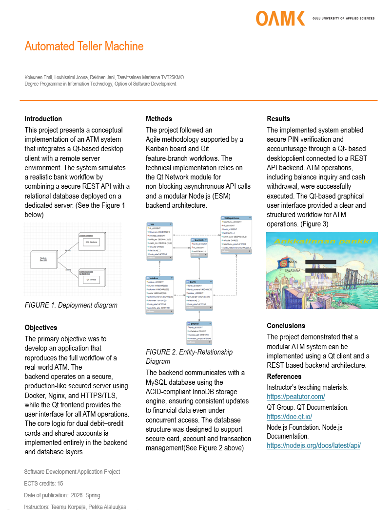

# Ryhmä 4 Pankkiautomaatti projekti

Tämä projekti on Oulun ammattikorkeakoulun Tieto- ja viestintätekniikan tutkinto-ohjelman ohjelmistokehityksen sovellusprojekti, jossa toteutetaan pankkiautomaattijärjestelmä.

##  Sisällysluettelo
- [Projektin kuvaus](#projektin-kuvaus)
- [Ominaisuudet](#ominaisuudet)
- [Palvelinympäristö](#palvelinympäristö)
- [Frontend](#frontend)
- [Backend](#backend)
- [API-dokumentaatio](#api-dokumentaatio)
- [Tietokantarakenne](#tietokantarakenne)
- [Poster](#poster)
- [Kehitystiimi](#kehitystiimi)

## Projektin kuvaus

Projekti koostuu kolmesta pääkomponentista:

### Frontend / Asiakasohjelma 
- Toteutettu **C++**-kielellä **Qt Creator**:issa
- Vastaa pankkiautomaatin käyttöliittymästä
- Graafinen käyttöliittymä pankkiautomaatin toiminnoille

### Backend / REST API
- Toteutettu **Node.js** ympäristössä käyttäen **Express**-kehystä
- Vastaa tietokantayhteyksistä ja autentikoinnista
- Tuottaa REST-rajapinnan frontend-sovellukselle
- JWT-pohjainen autentikointi

### Palvelinympäristö
- Toteutettu **CSC:n Linux-palvelimessa** Docker-konttien avulla
- **MySQL** -tietokanta tietojen tallentamiseen
- **Nginx** reverse proxy ja load balancer
- Docker Compose orkestraatio


##  Ominaisuudet

### Pankkiautomaatin toiminnot:
- ✅ **PIN-koodin vahvistus** korttinumerolla
- ✅ **Kortin valinta** (debit, kaksoiskortti = debit + credit)
- ✅ **Tilin saldokysely** 
- ✅ **Rahan nosto** 
- ✅ **Rahan talletus**
- ✅ **Tilitapahtumien selaus** (viimeisimmät 10 tapahtumaa)


### Turvallisuusominaisuudet:
- 🔒 **PIN-koodin suojaus** bcrypt-hashauksella
- 🔒 **JWT-autentikointi** API-kutsuille
- 🔒 **PIN-yritysraja** (kortti lukittuu liian monen väärän yrityksen jälkeen)
- 🔒 **Helmet.js** HTTP-headerien suojaukseen
- 🔒 **HTTPS/SSL** tuotantoympäristössä (Let's Encrypt)


## Palvelinympäristö 

#### Teknologiat 

- **Docker & Docker Compose**
- **Nginx 1.24** (Alpine)
- **MySQL 8.0**
- **Let's Encrypt** SSL-sertifikaatit


## Frontend

### Rakenne

// tähän qt tiedosto rakenne

####  Teknologiat
- **C++**
- **Qt 6.x Framework** (Widgets, Network, Core)
- **Qt Creator** IDE + Qt Designer
- **CMake** build system
- **Qt Signals & Slots** - Tapahtumankäsittely
- **QNetworkAccessManager** - REST API -kommunikaatio
- **Qt Resource System** (.qrc) - Staattisten resurssien hallinta
- **Qt StyleSheets** - UI-tyylittely


## Backend

### Rakenne

```
backend/
├── bin/
│   └── www                        # Express serverin käynnistysskripti
├── src/
│   ├── db.js                      # MySQL-tietokantayhteyden hallinta
│   ├── server.js                  # Express-sovelluksen pääkonfiguraatio
│   ├── middleware/
│   │   └── authenticateToken.js   # JWT-tokenin validointimiddleware
│   ├── models/
│   │   ├── asiakasModel.js        # Asiakas-taulun tietokantakyselyt
│   │   ├── authModel.js           # Autentikoinnin tietokantakyselyt
│   │   ├── korttiModel.js         # Kortti-taulun tietokantakyselyt
│   │   ├── tili_models.js         # Tili-taulun tietokantakyselyt
│   │   └── transaktio_models.js   # Transaktio-taulun tietokantakyselyt
│   └── routes/
│       ├── asiakasRoutes.js       # /api/asiakas/* endpointit
│       ├── authRoutes.js          # /api/auth/* endpointit (PIN-vahvistus)
│       ├── korttiRoutes.js        # /api/kortti/* endpointit
│       ├── tiliRoutes.js          # /api/tili/* endpointit
│       └── transaktioRoutes.js    # /api/transaktio/* endpointit
├── Dockerfile                     # Backend-kontin määritykset
├── package.json                   # Node.js riippuvuudet ja skriptit
└── .env                           # Ympäristömuuttujat (DB-yhteys, JWT-salaisuus)
```

#### Teknologiat

- **Node.js** (Express 4.19.2)
- **MySQL 8.0**
- **JWT** (jsonwebtoken 9.0.0) autentikointiin
- **bcryptjs** (2.4.3) salasanojen hashaukseen
- **Helmet** turvallisuusheadereille
- **Morgan** lokitukseen


##  API-dokumentaatio

Backend API on saatavilla osoitteessa: //TÄHÄN SWAGGER

### Autentikointi

#### POST `/api/auth/verify-pin`
Tarkistaa kortin PIN-koodin ja palauttaa JWT-tokenin.

**Request Body:**
```json
{
  "kortti_numero": "4000-1234-5678-0001",
  "pin": "1234"
}
```

**Response:**
```json
{
  "success": true,
  "token": "jwt-token",
  "kortti_id": 1,
  "cardType": "COMBO",
  "tilit": [
    {
      "tili_id": 1,
      "rooli": "DEBIT"
    },
    {
      "tili_id": 2,
      "rooli": "CREDIT"
    }
  ]
}
```

### Tilitoiminnot

#### GET `/api/kortti/asiakas/:asiakas_id`
Hakee asiakkaan kaikki kortit.


#### GET `/api/kortti/korttiDetails/:kortti_id`
Hakee kaikki kortin tiedot.


#### GET `/api/kortti/:kortti_id/balance`
Hakee kortin saldon ja credit limitin.


**Response:**
```json
{
  "saldo_eur": "120.50",
  "credit_limit": "3000",
  "kortti_numero": "3700-0002-9999-9999"
}
```


### Transaktiot

#### GET `/api/transaktio/tapahtumat/:kortti_id`
Hakee kortin tilitapahtumat.


#### POST `/api/transaktio/kayttosaldo`
Hakee käyttösaldon.

**Request Body:**
```json
{
  "kortti_id": 1,
  "tili_id": 1
}
```

#### POST `/api/transaktio/nosta`
Tekee nostotapahtuman.

**Request Body:**
```json
{
  "tili_id": 1,
  "kortti_id": 1,
  "summa_eur": 20.00
}
```

#### GET `/api/transaktio/tapahtumat/:tili_id`
Hakee 10 viimeisintä tapahtumaa.

### Asiakastoiminnot

#### GET `/api/asiakas/:asiakas_id/tilit`
Hakee asiakkaan kaikki tilit.

##  Tietokantarakenne

   

   *Tietokannan ER-kaavio.*

##  Poster



    

##  Kehitystiimi

Oulun ammattikorkeakoulu TVT25KMO opiskelijaryhmä 4.

- Marianna Taavitsainen
- Rekinen Jani   
- Koivunen Emil
- Louhisalmi Joona


