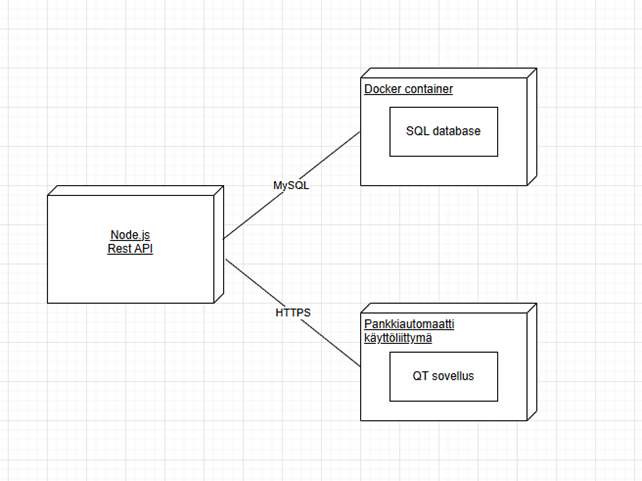
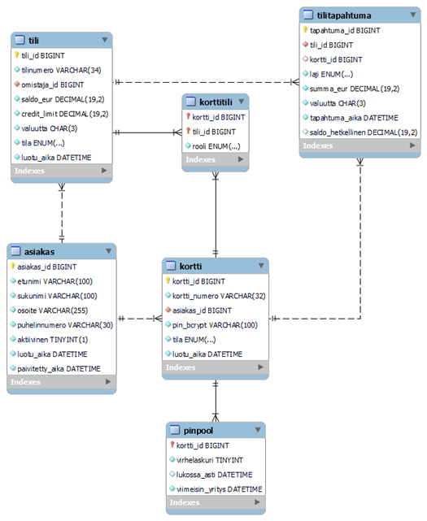

# Ryhmä 4 Pankkiautomaatti projekti

Tämä projekti on Oulun ammattikorkeakoulun Tieto- ja viestintätekniikan tutkinto-ohjelman ohjelmistokehityksen sovellusprojekti, jossa toteutetaan pankkiautomaattijärjestelmä.

## 📋 Sisällysluettelo
- [Projektin kuvaus](#projektin-kuvaus)
- [Ominaisuudet](#ominaisuudet)
- [Palvelinympäristö](#palvelinympäristö)
- [Frontend](#frontend)
- [Backend](#backend)
- [API-dokumentaatio](#api-dokumentaatio)
- [Tietokantarakenne](#tietokantarakenne)
- [Kehitystiimi](#kehitystiimi)

## Projektin kuvaus

Projekti koostuu kolmesta pääkomponentista:

### Frontend / Asiakasohjelma 
- Toteutettu **C++**-kielellä **Qt Creator**:issa
- Vastaa pankkiautomaatin käyttöliittymästä
- Graafinen käyttöliittymä pankkiautomaatin toiminnoille

### Backend / REST API
- Toteutettu **Node.js** ympäristössä käyttäen **Express**-kehystä
- Vastaa tietokantayhteyksistä ja autentikoinnista
- Tuottaa REST-rajapinnan frontend-sovellukselle
- JWT-pohjainen autentikointi

### Palvelinympäristö
- Toteutettu **CSC:n Linux-palvelimessa** Docker-konttien avulla
- **MySQL** -tietokanta tietojen tallentamiseen
- **Nginx** reverse proxy ja load balancer
- Docker Compose orkestraatio





##  Ominaisuudet

### Pankkiautomaatin toiminnot:
- ✅ **PIN-koodin vahvistus** korttinumerolla
- ✅ **Kortin valinta** (debit, kaksoiskortti = debit + credit)
- ✅ **Tilin saldokysely** 
- ✅ **Rahan nosto** 
- ✅ **Rahan talletus**
- ✅ **Tilitapahtumien selaus** (viimeisimmät 10 tapahtumaa)


### Turvallisuusominaisuudet:
- 🔒 **PIN-koodin suojaus** bcrypt-hashauksella
- 🔒 **JWT-autentikointi** API-kutsuille
- 🔒 **PIN-yritysraja** (kortti lukittuu liian monen väärän yrityksen jälkeen)
- 🔒 **Helmet.js** HTTP-headerien suojaukseen
- 🔒 **HTTPS/SSL** tuotantoympäristössä (Let's Encrypt)


## Palvelinympäristö 

#### Teknologiat 

- **Docker & Docker Compose**
- **Nginx 1.24** (Alpine)
- **MySQL 8.0**
- **Let's Encrypt** SSL-sertifikaatit


## Frontend

### Rakenne

// tähän qt tiedosto rakenne

####  Teknologiat
- **C++**
- **Qt Framework** (Qt Creator)
- **CMake** build-järjestelmä
- //QT HOMMELEITA LISÄÄ


## Backend

### Rakenne

// tähän bäkkäri tiedosto rakenne

#### Teknologiat

- **Node.js** (Express 4.19.2)
- **MySQL 8.0**
- **JWT** (jsonwebtoken 9.0.0) autentikointiin
- **bcryptjs** (2.4.3) salasanojen hashaukseen
- **Helmet** turvallisuusheadereille
- **Morgan** lokitukseen


##  API-dokumentaatio

Backend API on saatavilla osoitteessa: //TÄHÄN SWAGGER

### Autentikointi

#### POST `/api/auth/verify-pin`
Tarkistaa kortin PIN-koodin ja palauttaa JWT-tokenin.

**Request Body:**
```json
{
  "kortti_numero": "4000-1234-5678-0001",
  "pin": "1234"
}
```

**Response:**
```json
{
  "success": true,
  "token": "jwt-token",
  "kortti_id": 1,
  "cardType": "DEBIT"
}
```

### Tilitoiminnot

#### GET `/api/tili/:tili_id/debit`
Hakee tilin saldon ja tilan.

**Response:**
```json
{
  "tili_id": 1,
  "tilinumero": "FI1234567890",
  "saldo_eur": 1500.00,
  "tila": "ACTIVE"
}
```

#### GET `/api/tili/:tili_id/credit`
Hakee tilin saldon ja credit limitin.

### Transaktiot

#### POST `/api/transaktio/nosta`
Tekee nostotapahtuman.

**Request Body:**
```json
{
  "tili_id": 1,
  "kortti_id": 1,
  "summa_eur": 100.00
}
```

#### GET `/api/transaktio/tapahtumat/:tili_id`
Hakee 10 viimeisintä tapahtumaa.

### Korttitoiminnot

#### GET `/api/kortti/asiakas/:asiakas_id`
Hakee asiakkaan kaikki kortit.

### Asiakastoiminnot

#### GET `/api/asiakas/:asiakas_id/tilit`
Hakee asiakkaan kaikki tilit.

##  Tietokantarakenne

   

   *Tietokannan ER-kaavio.*


##  Kehitystiimi

Oulun ammattikorkeakoulu TVT25KMO opiskelijaryhmä 4.

- Marianna Taavitsainen
- Rekinen Jani   
- Koivunen Emil
- Louhisalmi Joona


